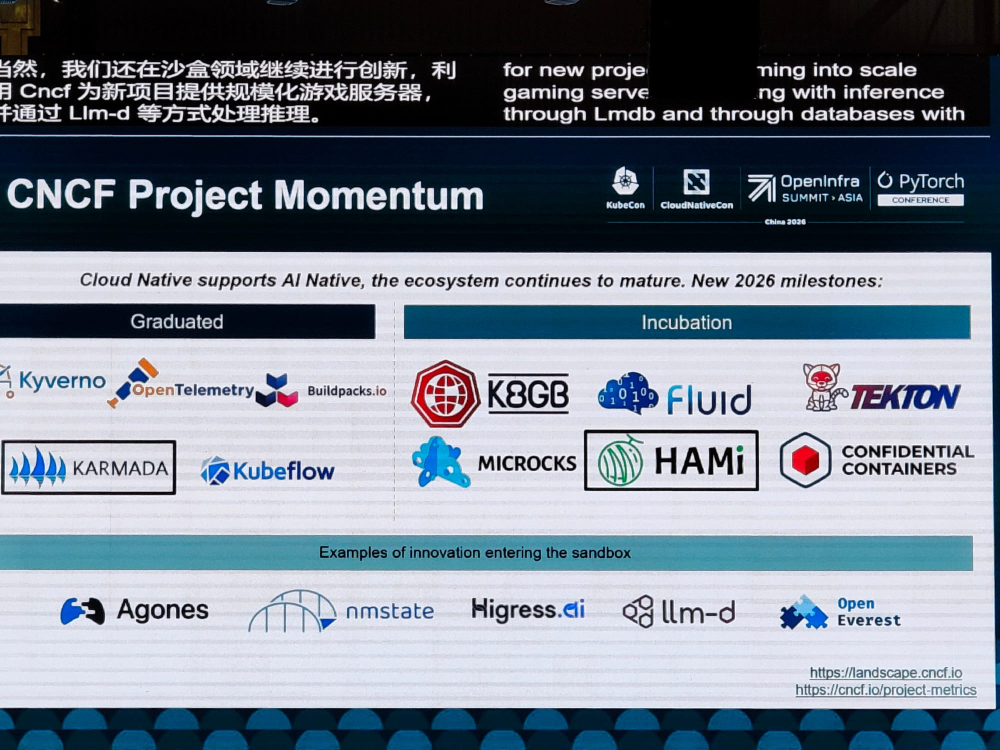

We finished [the OpenEverest Asian tour](https://openeverest.io/blog/asian-conf-tour-2026/) in Shanghai with [KubeCon + CloudNativeCon China](https://www.lfopensource.cn/kubecon-cloudnativecon-openinfra-summit-pytorch-conference-china/). In practice it was more than a single KubeCon — it was a blend of events: KubeCon + CloudNativeCon, OpenInfra Summit, and the PyTorch Conference all under one roof. Because of that mix, and the AI hype driving the agenda, the talks were extremely diverse and not always tied to cloud native. There were plenty of conversations about GPU management, machine learning, and training large language models with PyTorch and its surrounding ecosystem.

But let's take it one step at a time. Below is my take on the conference.

## Talks

If I had to summarize [the schedule](https://www.lfopensource.cn/kubecon-cloudnativecon-openinfra-summit-pytorch-conference-china/program/schedule/) in one sentence: this was Kubernetes as the operating system for AI production, co-hosted by the PyTorch Foundation. By my count, roughly 67 of the 95 sessions — about 70% — were AI-related in some way.

Only around eight talks were pure, traditional cloud-native infrastructure: Cilium, the Envoy dataplane, runc security, OpenStack migrations, Karmada updates, bootc/Ironic, KubeEdge, and impersonation controls. And even most of the "infrastructure" talks justified themselves through AI workloads — DRA for GPU scheduling, Kata for agent sandboxing, Dragonfly for model distribution. AI was not just a track; it was the gravitational center of the whole event.

A few patterns stood out to me:

- **Huawei was everywhere.** They showed up in roughly a dozen slots — keynotes, the Ascend and PyTorch ecosystem, HyperParallel, vLLM/Volcano/KV-cache talks, and lightning talks — and also sponsored the community night and a co-located day.
- **Meta brought serious training content.** Four solid talks: 100k-GPU fault tolerance, KernelAgent, PyTorch optimizers, and the Helion CuTe DSL — a strong signal on both NVIDIA alternatives and training efficiency.
- **Banks are now presenting like hyperscalers.** China Merchants Bank alone had three sessions — a Tidal autoscaling keynote, digital employees at scale, and LLM training-as-a-service — a bank talking about GPU scheduling the way a cloud provider would.
- **vLLM was the center of gravity.** More than eight sessions across the two days covered PD disaggregation, KV cache management, day-0 multi-backend inference, Helion tuning, and TTFT observability.
- **Agentic AI is the clear second wave.** Around ten sessions covered agent runtimes, agent sandboxes, agent observability, and agent KV-cache — largely from Ant Group, Alibaba, Red Hat, and ZTE.
- **Alternative accelerators were a recurring theme.** Ascend, Cambricon, RISC-V, and "device-agnostic PyTorch" formed a distinctly China-stack narrative. NVIDIA was present, but far from dominant. [HAMi](https://github.com/project-hami/hami) was mentioned a few million times during these talks.

It was surprising to see that the majority of the talks were given in Chinese. What surprised me even more was occasionally walking into a session labeled "English" in the schedule, only to find it delivered in Chinese — with English slides. :)

AI was the thread running through every keynote. It was great to see OpenEverest called out during a keynote as one of the interesting CNCF Sandbox projects.

I also didn't expect the maintainers track — where I gave my talk — to have such a large room, and it was full every time. That was really good to see.

## Chinese projects

Whenever I travel to Asia, it is fascinating to watch how the project landscape shifts. In Japan and Taipei, for example, we noticed that MySQL and its derivatives — MariaDB, TiDB — are more popular than PostgreSQL.

Mainland China was a different world entirely. It runs on its own technologies — names I had heard of but never realized were this widely adopted.

### Dragonfly

When I first heard "Dragonfly", I immediately thought of [dragonflydb](https://github.com/dragonflydb/dragonfly), the Redis alternative. But it turns out this is a different project: [dragonflyoss/dragonfly](https://github.com/dragonflyoss/dragonfly) — a solution for delivering container images, models, and other content efficiently using P2P technology. It has 3.3k stars on GitHub and is extremely popular, especially given the push to speed up LLM serving.

### OceanBase

A distributed relational database developed by [Ant Group](https://www.antgroup.com/en). Their main repository, [oceanbase/oceanbase](https://github.com/oceanbase/oceanbase), has 10.3k GitHub stars, with contributions coming mostly from the Chinese community. And it is genuinely popular. On their website they publish a list of customers using it: [en.oceanbase.com/customer/home](https://en.oceanbase.com/customer/home). You'll spot brands like Xiaomi, Li-Ning, and Alipay, alongside companies such as [Trip.com](https://en.oceanbase.com/customer/ctrip) and [Vivo](https://en.oceanbase.com/customer/vivo).

### SGLang

I had heard of SGLang before, but I hadn't realized how big its community is: almost 2,000 contributors and 35.8k stars on GitHub ([sgl-project/sglang](https://github.com/sgl-project/sglang)). A direct competitor to vLLM, this LLM serving framework is catching up fast. It can't really be called a "Chinese project" anymore — its adoption has spread well beyond China and Asia — but the majority of contributions still come from China and companies based there.

## Project pavilion

For me, the second day of the conference was all about the project booth, where I was the sole representative of OpenEverest. The project pavilion was in the main hall, right next to the big booths, so foot traffic was strong. It was a great opportunity to spread the word about OpenEverest, explain its value, and share the direction we're taking it. I was glad to see people interested in trying out the KServe provider in OpenEverest.

One unusual conversation involved me explaining what Kubernetes is — a little surprising at a CloudNativeCon. :)

Overall, I really enjoyed the community, the new people I met, and the connections I made. Worth doing again next year, for sure.

---

**Didn't catch us in Shanghai, but want to connect?**

- **Contribute:** dive into our [Good First Issues](https://github.com/orgs/openeverest/projects/2) and [repositories](https://github.com/openeverest).
- **Chat:** join the conversation in the CNCF Slack (channel: [#openeverest-users](https://cloud-native.slack.com/archives/C09RRGZL2UX)).
- **Follow:** stay in the loop on [LinkedIn](https://www.linkedin.com/company/openeverest/).
- **Explore:** see where we'll be next on our [events page](https://openeverest.io/resources/).

  <a href="https://cloud-native.slack.com/archives/C09RRGZL2UX" target="_blank" rel="noopener noreferrer" style="display:inline-flex;align-items:center;gap:8px;background-color:#4A154B;color:#fff;text-decoration:none;padding:10px 20px;border-radius:6px;font-weight:600;font-size:15px;">
    <svg xmlns="http://www.w3.org/2000/svg" width="20" height="20" viewBox="0 0 122.8 122.8"><path d="M25.8 77.6c0 7.1-5.8 12.9-12.9 12.9S0 84.7 0 77.6s5.8-12.9 12.9-12.9h12.9v12.9zm6.5 0c0-7.1 5.8-12.9 12.9-12.9s12.9 5.8 12.9 12.9v32.3c0 7.1-5.8 12.9-12.9 12.9s-12.9-5.8-12.9-12.9V77.6z" fill="#e01e5a"/><path d="M45.2 25.8c-7.1 0-12.9-5.8-12.9-12.9S38.1 0 45.2 0s12.9 5.8 12.9 12.9v12.9H45.2zm0 6.5c7.1 0 12.9 5.8 12.9 12.9s-5.8 12.9-12.9 12.9H12.9C5.8 58.1 0 52.3 0 45.2s5.8-12.9 12.9-12.9h32.3z" fill="#36c5f0"/><path d="M97 45.2c0-7.1 5.8-12.9 12.9-12.9s12.9 5.8 12.9 12.9-5.8 12.9-12.9 12.9H97V45.2zm-6.5 0c0 7.1-5.8 12.9-12.9 12.9s-12.9-5.8-12.9-12.9V12.9C64.7 5.8 70.5 0 77.6 0s12.9 5.8 12.9 12.9v32.3z" fill="#2eb67d"/><path d="M77.6 97c7.1 0 12.9 5.8 12.9 12.9s-5.8 12.9-12.9 12.9-12.9-5.8-12.9-12.9V97h12.9zm0-6.5c-7.1 0-12.9-5.8-12.9-12.9s5.8-12.9 12.9-12.9h32.3c7.1 0 12.9 5.8 12.9 12.9s-5.8 12.9-12.9 12.9H77.6z" fill="#ecb22e"/></svg>
    Join Slack
  </a>
  <a href="https://github.com/openeverest/openeverest" target="_blank" rel="noopener noreferrer" style="display:inline-flex;align-items:center;gap:8px;background-color:#24292f;color:#fff;text-decoration:none;padding:10px 20px;border-radius:6px;font-weight:600;font-size:15px;">
    <svg xmlns="http://www.w3.org/2000/svg" width="20" height="20" viewBox="0 0 16 16" fill="#fff"><path d="M8 .25a7.75 7.75 0 1 0 0 15.5A7.75 7.75 0 0 0 8 .25zm0 1.5a6.25 6.25 0 0 1 1.97 12.18c-.31.06-.42-.13-.42-.3v-1.05c0-.36-.01-1.02-.49-1.4 1.62-.18 2.5-.88 2.5-2.57 0-.57-.2-1.1-.53-1.49.05-.14.23-.7-.05-1.47 0 0-.44-.14-1.44.54a5.02 5.02 0 0 0-2.62 0C5.93 6.6 5.49 6.74 5.49 6.74c-.28.77-.1 1.33-.05 1.47-.33.39-.53.92-.53 1.49 0 1.69.88 2.39 2.5 2.57-.31.27-.43.67-.47 1.04-.42.19-1.5.52-2.16-.62 0 0-.39-.71-1.13-.76 0 0-.72-.01-.05.45 0 0 .48.23.82 1.08 0 0 .43 1.32 2.49.87v.75c0 .17-.11.36-.42.3A6.25 6.25 0 0 1 8 1.75z"/></svg>
    Star the Repo
  </a>

